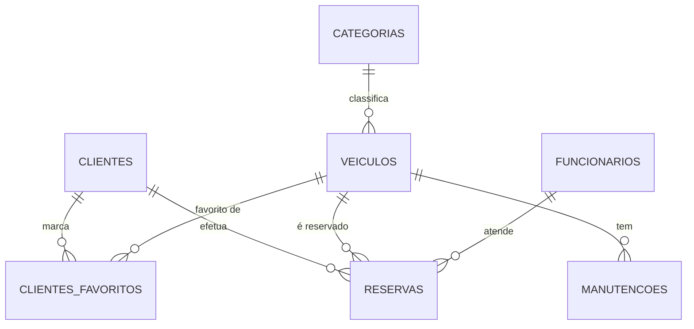

# Capítulo 2 – Arquitetura e Modelo de Dados

## 2.1 Arquitetura Geral do Sistema

O sistema **Car4Me** segue uma **arquitetura em três camadas** (Three-Tier Architecture) moderna e escalável, permitindo separação clara de responsabilidades e comunicação através de padrões REST.

A solução completa é composta por:
- **Camada de Dados** — MySQL 8.0
- **Camada de Aplicação** — LoopBack 4 API (Node.js + TypeScript)
- **Camada de Apresentação** — React Admin (React 18)

Toda a infraestrutura está **containerizada com Docker**, garantindo portabilidade, isolamento e facilidade de deploy.

A documentação técnica é automaticamente gerada através de **OpenAPI 3.0**, permitindo visualização e teste através do Swagger UI no endpoint `/explorer`.

### Diagrama de Arquitetura

```
┌─────────────────────────────────────────────────────────────┐
│                  CAMADA DE APRESENTAÇÃO                     │
│                   (React Admin + Nginx)                     │
│                      Container: backoffice                   │
│                      Porta Exposta: 8080                    │
│                      Tecnologias: React 18, Material-UI     │
└──────────────────────┬──────────────────────────────────────┘
                       │
                       │ HTTP/REST (fetch API)
                       │ http://localhost:3000
                       ↓
┌─────────────────────────────────────────────────────────────┐
│                   CAMADA DE APLICAÇÃO                       │
│            (LoopBack 4 API + Node.js + TypeScript)          │
│                      Container: api                         │
│                      Porta Exposta: 3000                    │
│                      Endpoint Explorer: /explorer           │
│                      Documentação: OpenAPI 3.0              │
└──────────────────────┬──────────────────────────────────────┘
                       │
                       │ MySQL Connector
                       │ mysql://db:3306
                       ↓
┌─────────────────────────────────────────────────────────────┐
│                     CAMADA DE DADOS                         │
│                    (MySQL 8.0 + InnoDB)                     │
│                      Container: db                          │
│                      Porta Exposta: 3007                    │
│                      Volume Persistente: db_data            │
└─────────────────────────────────────────────────────────────┘
```

### 2.1.1 Comunicação entre Camadas

**Frontend → API:**
- Protocolo: HTTP/REST
- URL: `http://localhost:3000`
- Formato: JSON
- Métodos: GET, POST, PATCH, DELETE

**API → Base de Dados:**
- Protocolo: MySQL Protocol
- Host interno Docker: `db:3306`
- Driver: `@loopback/connector-mysql`
- Pool de conexões configurado

---

## 2.2 Estrutura de Pastas do Projeto

O projeto foi reorganizado para acomodar as três componentes principais:

```
Car4Me_Projeto/
├── docker-compose.env.yml           # Orquestração completa (3 containers)
│
├── mysql-init/                      # Scripts de inicialização MySQL
│   ├── Dockerfile                   # Build personalizado MySQL
│   ├── 01-schema.sql                # Estrutura das tabelas
│   └── 02-data.sql                  # Dados iniciais
│
├── Car4Me_loop/car4me/              # Backend LoopBack 4
│   ├── Dockerfile                   # Build do container API
│   ├── src/
│   │   ├── controllers/             # Controllers REST
│   │   │   ├── cliente.controller.ts
│   │   │   ├── veiculo.controller.ts
│   │   │   ├── reserva.controller.ts
│   │   │   ├── manutencao.controller.ts
│   │   │   └── cliente-favorito.controller.ts  # Relação M:N
│   │   ├── models/                  # Models TypeScript
│   │   ├── repositories/            # Repositories (data access)
│   │   └── datasources/             # Configuração MySQL
│   │       └── db.datasource.ts
│   ├── package.json
│   └── tsconfig.json
│
└── Car4Me_loop/car4me/car4me-react_admin/  # Frontend React Admin
    ├── Dockerfile                   # Build multi-stage (Node + Nginx)
    ├── nginx.conf                   # Configuração Nginx
    ├── src/
    │   ├── App.js                   # Configuração React Admin
    │   ├── dataProvider.js          # Comunicação com API
    │   ├── i18n/                    # Traduções PT-PT
    │   └── resources/               # Componentes CRUD
    │       ├── clientes.jsx
    │       ├── veiculos.jsx
    │       ├── reservas.jsx
    │       ├── manutencoes.jsx
    │       ├── cliente-favoritos.jsx
    │       └── Dashboard.jsx
    └── package.json
```

---

## 2.3 Tecnologias Utilizadas

### 2.3.1 Backend (API)

| Tecnologia | Versão | Função |
|-----------|--------|--------|
| **Node.js** | 18 LTS | Ambiente de execução JavaScript |
| **LoopBack 4** | 0.x | Framework enterprise para APIs REST |
| **TypeScript** | 5.x | Superset tipado de JavaScript |
| **@loopback/connector-mysql** | - | Driver oficial MySQL para LoopBack |
| **OpenAPI 3.0** | - | Documentação automática da API |

### 2.3.2 Frontend (Backoffice)

| Tecnologia | Versão | Função |
|-----------|--------|--------|
| **React** | 18 | Biblioteca para interfaces de utilizador |
| **React Admin** | 4.x | Framework para dashboards administrativos |
| **Material-UI** | 5.x | Biblioteca de componentes visuais |
| **react-i18next** | - | Sistema de internacionalização (PT-PT) |

### 2.3.3 Base de Dados

| Tecnologia | Versão | Função |
|-----------|--------|--------|
| **MySQL** | 8.0 | Sistema de gestão de BD relacional |
| **InnoDB** | - | Motor de armazenamento transacional |

### 2.3.4 DevOps

| Tecnologia | Versão | Função |
|-----------|--------|--------|
| **Docker** | 20+ | Plataforma de containerização |
| **Docker Compose** | 2.x | Orquestração de múltiplos containers |
| **Nginx** | Alpine | Servidor web de alto desempenho |

---

## 2.4 Modelo de Dados Relacional

A base de dados do sistema Car4Me foi desenhada para refletir as operações reais de uma empresa de aluguer de veículos. O modelo segue uma estrutura relacional normalizada com múltiplas relações 1:N e uma relação N:N (favoritos).

### Entidades Principais

- **categorias** — Tipos de veículos e preços
- **veiculos** — Frota completa
- **clientes** — Utilizadores do serviço
- **funcionarios** — Equipa da empresa
- **reservas** — Alugueres efetuados
- **manutencoes** — Intervenções nos veículos
- **clientes_favoritos** — Relação N:N (Cliente ↔ Veículo)

---

### 2.4.1 Diagrama Entidade-Relacionamento



---

### 2.4.2 Descrição Detalhada das Tabelas

#### **Tabela `categorias`**
Armazena os diferentes tipos de veículos disponíveis na empresa e o respetivo preço diário.

**Campos:**
- `id_categoria` — Chave primária (INT, AUTO_INCREMENT)
- `nome` — Nome da categoria (VARCHAR, UNIQUE)
  - Exemplos: 'Elétrico', 'Diesel', 'Gasolina', 'Híbrido', 'GPL'
- `preco_dia` — Preço por dia (DECIMAL 10,2)

**Constraints:**
- PRIMARY KEY (`id_categoria`)
- UNIQUE (`nome`)

**Relações:**
- Categoria (1) → (N) Veículos

---

#### **Tabela `veiculos`**
Tabela central que armazena toda a frota de automóveis da empresa.

**Campos:**
- `id_veiculo` — Chave primária (INT, AUTO_INCREMENT)
- `marca` — ENUM com 30 marcas pré-definidas
  - Audi, BMW, Mercedes, Volkswagen, Renault, Peugeot, Citroen, Toyota, Nissan, Honda, Hyundai, Kia, Ford, Opel, Volvo, Fiat, Seat, Skoda, Mazda, Mitsubishi, Jeep, Land Rover, Mini, Porsche, Lexus, Subaru, Alfa Romeo, Dacia, Jaguar, Chevrolet
- `modelo` — Modelo do veículo (VARCHAR 50)
- `matricula` — Matrícula única (VARCHAR 20, UNIQUE)
- `ano` — Ano de fabrico (INT)
- `cor` — Cor do veículo (VARCHAR 30)
- `quilometragem` — Quilómetros atuais (INT, DEFAULT 0)
- `estado` — ENUM ('Disponivel', 'Alugado', 'Manutencao')
- `id_categoria` — Chave estrangeira para `categorias`

**Constraints:**
- PRIMARY KEY (`id_veiculo`)
- UNIQUE (`matricula`)
- FOREIGN KEY (`id_categoria`) REFERENCES `categorias`(`id_categoria`)
  - ON UPDATE CASCADE
  - ON DELETE RESTRICT

**Índices:**
- INDEX `idx_veiculos_categoria` ON (`id_categoria`)
- INDEX `idx_veiculos_estado` ON (`estado`)

**Relações:**
- Veículo (N) → (1) Categoria
- Veículo (1) → (N) Reservas
- Veículo (1) → (N) Manutenções
- Veículo (N) ↔ (N) Clientes (via `clientes_favoritos`)

---

#### **Tabela `clientes`**
Armazena os dados pessoais dos clientes que realizam reservas.

**Campos:**
- `id_cliente` — Chave primária (INT, AUTO_INCREMENT)
- `nome` — Nome completo (VARCHAR 100)
- `email` — Email único (VARCHAR 150, UNIQUE)
- `telefone` — Telefone (VARCHAR 20)
- `nif` — NIF único com 9 dígitos (VARCHAR 20, UNIQUE)
- `morada` — Morada completa (VARCHAR 255)

**Constraints:**
- PRIMARY KEY (`id_cliente`)
- UNIQUE (`email`)
- UNIQUE (`nif`)

**Índices:**
- INDEX `idx_clientes_nome` ON (`nome`)

**Relações:**
- Cliente (1) → (N) Reservas
- Cliente (N) ↔ (N) Veículos Favoritos

**Validações (aplicadas no LoopBack):**
- NIF: exatamente 9 dígitos numéricos
- Email: formato válido
- Telefone: 9 dígitos

---

#### **Tabela `funcionarios`**
Armazena os funcionários responsáveis por gerir reservas e atender clientes.

**Campos:**
- `id_funcionario` — Chave primária (INT, AUTO_INCREMENT)
- `nome` — Nome completo (VARCHAR 100)
- `email` — Email único (VARCHAR 150, UNIQUE)
- `cargo` — Cargo na empresa (VARCHAR 50)
  - Exemplos: 'Gestor de Frota', 'Atendimento', 'Mecânico', 'Supervisor'
- `telefone` — Telefone (VARCHAR 20)

**Constraints:**
- PRIMARY KEY (`id_funcionario`)
- UNIQUE (`email`)

**Índices:**
- INDEX `idx_funcionarios_nome` ON (`nome`)

**Relações:**
- Funcionário (1) → (N) Reservas

---

#### **Tabela `reservas`**
Regista cada aluguer efetuado, ligando cliente, veículo e funcionário responsável.

**Campos:**
- `id_reserva` — Chave primária (INT, AUTO_INCREMENT)
- `id_cliente` — FK para `clientes` (INT, NOT NULL)
- `id_veiculo` — FK para `veiculos` (INT, NULL permitido)
- `id_funcionario` — FK para `funcionarios` (INT, NOT NULL)
- `data_inicio` — Data/hora de início (DATETIME)
- `data_fim` — Data/hora de fim (DATETIME)
- `preco_total` — Preço total da reserva (DECIMAL 10,2)
- `estado` — ENUM ('ativa', 'concluida', 'cancelada')

**Constraints:**
- PRIMARY KEY (`id_reserva`)
- FOREIGN KEY (`id_cliente`) REFERENCES `clientes`(`id_cliente`)
  - ON UPDATE CASCADE
  - ON DELETE RESTRICT
- FOREIGN KEY (`id_veiculo`) REFERENCES `veiculos`(`id_veiculo`)
  - ON UPDATE CASCADE
  - ON DELETE CASCADE
- FOREIGN KEY (`id_funcionario`) REFERENCES `funcionarios`(`id_funcionario`)
  - ON UPDATE CASCADE
  - ON DELETE RESTRICT

**Índices:**
- INDEX `idx_reservas_estado` ON (`estado`)
- INDEX `idx_reservas_data` ON (`data_inicio`, `data_fim`)

**Relações:**
- Reserva (N) → (1) Cliente
- Reserva (N) → (1) Veículo
- Reserva (N) → (1) Funcionário

---

#### **Tabela `manutencoes`**
Armazena todas as intervenções de manutenção efetuadas num veículo.

**Campos:**
- `id_manutencao` — Chave primária (INT, AUTO_INCREMENT)
- `id_veiculo` — FK para `veiculos` (INT, NOT NULL)
- `descricao` — Descrição da intervenção (VARCHAR 255)
- `data_manutencao` — Data/hora da manutenção (DATETIME)
- `custo` — Custo da intervenção (DECIMAL 10,2)

**Constraints:**
- PRIMARY KEY (`id_manutencao`)
- FOREIGN KEY (`id_veiculo`) REFERENCES `veiculos`(`id_veiculo`)
  - ON UPDATE CASCADE
  - ON DELETE RESTRICT

**Índices:**
- INDEX `idx_manutencoes_veiculo` ON (`id_veiculo`)

**Relações:**
- Manutenção (N) → (1) Veículo

---

#### **Tabela `clientes_favoritos` (Relação N:N)**

Tabela de junção que implementa a relação Many-to-Many entre clientes e veículos, permitindo que:
- Um cliente marque vários veículos como favoritos
- Um veículo seja favoritado por vários clientes

**Campos:**
- `id_cliente` — FK para `clientes` (INT, NOT NULL)
- `id_veiculo` — FK para `veiculos` (INT, NOT NULL)

**Constraints:**
- PRIMARY KEY composta (`id_cliente`, `id_veiculo`)
- FOREIGN KEY (`id_cliente`) REFERENCES `clientes`(`id_cliente`)
  - ON DELETE CASCADE
  - ON UPDATE CASCADE
- FOREIGN KEY (`id_veiculo`) REFERENCES `veiculos`(`id_veiculo`)
  - ON DELETE CASCADE
  - ON UPDATE CASCADE

**Relação representada:**
- Cliente (N) ↔ (N) Veículo

**Implementação no LoopBack 4:**
- Controller dedicado: `ClienteFavoritoController`
- Endpoints:
  - GET `/cliente-favoritos` — Listar todos
  - GET `/cliente-favoritos/{id_cliente}/{id_veiculo}` — Obter específico
  - POST `/cliente-favoritos` — Criar favorito
  - DELETE `/cliente-favoritos/{id_cliente}/{id_veiculo}` — Remover favorito

**Tratamento no Frontend:**
- DataProvider customizado para IDs compostos
- Visualização bidirecional (Cliente → Veículos | Veículo → Clientes)

---

## 2.5 Triggers Automáticos

A base de dados implementa **triggers** para automatizar processos relacionados com o estado dos veículos e manutenções:

### 2.5.1 Trigger: `veiculo_criado_gera_manutencao`
**Evento:** AFTER INSERT ON `veiculos`

**Descrição:**  
Quando um veículo é criado com estado 'Manutencao', gera automaticamente um registo na tabela `manutencoes`.

```sql
DELIMITER $$
CREATE TRIGGER veiculo_criado_gera_manutencao
AFTER INSERT ON veiculos
FOR EACH ROW
BEGIN
    IF NEW.estado = 'Manutencao' THEN
        INSERT INTO manutencoes (id_veiculo, descricao, data_manutencao, custo)
        VALUES (NEW.id_veiculo, 'Manutenção automática gerada ao criar veículo', NOW(), 0);
    END IF;
END $$
DELIMITER ;
```

### 2.5.2 Trigger: `veiculo_sai_de_manutencao_apaga_manutencoes`
**Evento:** AFTER UPDATE ON `veiculos`

**Descrição:**  
Quando um veículo sai do estado 'Manutencao' (para 'Disponivel' ou 'Alugado'), apaga automaticamente todos os registos de manutenção associados.

```sql
DELIMITER $$
CREATE TRIGGER veiculo_sai_de_manutencao_apaga_manutencoes
AFTER UPDATE ON veiculos
FOR EACH ROW
BEGIN
    IF OLD.estado = 'Manutencao' AND NEW.estado IN ('Disponivel', 'Alugado') THEN
        DELETE FROM manutencoes WHERE id_veiculo = NEW.id_veiculo;
    END IF;
END $$
DELIMITER ;
```

### 2.5.3 Trigger: `manutencao_criada_muda_estado`
**Evento:** AFTER INSERT ON `manutencoes`

**Descrição:**  
Quando uma nova manutenção é criada, altera automaticamente o estado do veículo para 'Manutencao'.

```sql
DELIMITER $$
CREATE TRIGGER manutencao_criada_muda_estado
AFTER INSERT ON manutencoes
FOR EACH ROW
BEGIN
    UPDATE veiculos SET estado = 'Manutencao' WHERE id_veiculo = NEW.id_veiculo;
END $$
DELIMITER ;
```

### 2.5.4 Trigger: `manutencao_atualizada_muda_estado`
**Evento:** AFTER UPDATE ON `manutencoes`

**Descrição:**  
Quando uma manutenção é atualizada, garante que o veículo permanece em estado 'Manutencao'.

```sql
DELIMITER $$
CREATE TRIGGER manutencao_atualizada_muda_estado
AFTER UPDATE ON manutencoes
FOR EACH ROW
BEGIN
    UPDATE veiculos SET estado = 'Manutencao' WHERE id_veiculo = NEW.id_veiculo;
END $$
DELIMITER ;
```

---

## 2.6 Regras de Integridade (DELETE)

A base de dados implementa regras de negócio rigorosas que condicionam a eliminação de registos sensíveis, garantindo a integridade e consistência dos dados.

### 2.6.1 Regras de Eliminação de Veículos

Um veículo **NÃO pode ser eliminado** se:
- Possuir **reservas ativas**
- Possuir **reservas canceladas**
- Possuir **manutenções registadas**

Um veículo **SÓ pode ser eliminado** quando:
- Não possuir qualquer reserva associada, **OU**
- Todas as reservas associadas estiverem no estado **concluída**

**Implementação:** Foreign key com `ON DELETE RESTRICT` na tabela `manutencoes`

### 2.6.2 Regras de Eliminação de Clientes

Um cliente **NÃO pode ser eliminado** se:
- Possuir qualquer reserva associada (independentemente do estado)

Um cliente **SÓ pode ser apagado** quando:
- Não possuir reservas registadas

**Implementação:** Foreign key com `ON DELETE RESTRICT` na tabela `reservas`

**Efeito CASCADE:**  
Ao eliminar um cliente, todos os seus favoritos são automaticamente removidos da tabela `clientes_favoritos` (CASCADE).

### 2.6.3 Regras de Eliminação de Funcionários

Um funcionário **NÃO pode ser eliminado** se:
- Estiver associado a pelo menos uma reserva

Um funcionário **SÓ pode ser apagado** quando:
- Não tiver registos na tabela `reservas`

**Implementação:** Foreign key com `ON DELETE RESTRICT` na tabela `reservas`

---

## 2.7 Documentação da API (OpenAPI 3.0)

O LoopBack 4 gera **automaticamente** a documentação OpenAPI 3.0 a partir dos controllers, models e decorators TypeScript.

### 2.7.1 Endpoints de Documentação

- **Swagger UI interativo:** `http://localhost:3000/explorer`
- **Especificação JSON:** `http://localhost:3000/openapi.json`
- **Especificação YAML:** `http://localhost:3000/openapi.yaml`

### 2.7.2 Estrutura Automática

O LoopBack 4 analisa automaticamente:
- **Controllers** — Gera `paths` para cada método
- **Models** — Gera `schemas` em `components`
- **Decorators** — Extrai parâmetros, respostas, validações
- **Relationships** — Documenta relações entre entidades

**Exemplo de Controller:**
```typescript
@get('/veiculos')
@response(200, {
  description: 'Array of Veiculo model instances',
  content: {'application/json': {schema: {type: 'array', items: getModelSchemaRef(Veiculo)}}},
})
async find(@param.filter(Veiculo) filter?: Filter<Veiculo>): Promise<Veiculo[]> {
  return this.veiculoRepository.find(filter);
}
```

Este código gera automaticamente no OpenAPI:
- Path: `/veiculos`
- Método: GET
- Resposta 200 com schema do model `Veiculo`
- Suporte a filtros Query

### 2.7.3 Benefícios da Geração Automática

✅ **Sempre sincronizado** — Documentação nunca fica desatualizada  
✅ **Menos erros** — Não há discrepâncias entre código e docs  
✅ **Produtividade** — Não é necessário escrever YAML manualmente  
✅ **Type-safe** — TypeScript garante consistência

---

## 2.8 Containerização com Docker

O sistema completo está containerizado em **3 containers Docker** independentes e comunicantes.

### 2.8.1 Arquitectura de Containers

```
┌─────────────────────────────────────────────┐
│  Container: backoffice (React Admin)        │
│  Porta: 8080 → 80                           │
│  Tecnologia: Node 20 + Nginx Alpine         │
│  Build: Multi-stage (build + serve)         │
└────────────┬────────────────────────────────┘
             │
             ↓ HTTP
┌─────────────────────────────────────────────┐
│  Container: api (LoopBack 4)                │
│  Porta: 3000 → 3000                         │
│  Tecnologia: Node 18 Alpine                 │
│  Build: npm ci + npm run build              │
└────────────┬────────────────────────────────┘
             │
             ↓ MySQL Protocol
┌─────────────────────────────────────────────┐
│  Container: db (MySQL 8.0)                  │
│  Porta: 3007 → 3306                         │
│  Volume: db_data (persistente)              │
│  Healthcheck: mysqladmin ping               │
└─────────────────────────────────────────────┘
```

### 2.8.2 Ficheiro docker-compose.env.yml

O sistema utiliza **variáveis de ambiente** para configuração flexível:

```yaml
services:
  db:
    build:
      context: ./mysql-init
      dockerfile: Dockerfile
    container_name: car4me-mysql
    environment:
      MYSQL_ROOT_PASSWORD: root
      MYSQL_DATABASE: car4me
      MYSQL_USER: car4me
      MYSQL_PASSWORD: car4me
    ports:
      - "3007:3306"
    volumes:
      - db_data:/var/lib/mysql
    healthcheck:
      test: ["CMD", "mysqladmin", "ping", "-h", "127.0.0.1", "-uroot", "-proot"]
      interval: 5s
      timeout: 5s
      retries: 20

  api:
    build:
      context: ./Car4Me_loop/car4me
      dockerfile: Dockerfile
    container_name: car4me-api
    environment:
      HOST: 0.0.0.0
      PORT: 3000
      NODE_ENV: production
      # Dentro do Docker: host=db (nome do serviço)
      DB_HOST: db
      DB_PORT: 3306
      DB_USER: car4me
      DB_PASSWORD: car4me
      DB_DATABASE: car4me
    ports:
      - "3000:3000"
    depends_on:
      db:
        condition: service_healthy

  backoffice:
    build:
      context: ./Car4Me_loop/car4me/car4me-react_admin
      dockerfile: Dockerfile
      args:
        # O browser acede à API via localhost (porta publicada)
        REACT_APP_API_URL: http://localhost:3000
    container_name: car4me-backoffice
    ports:
      - "8080:80"
    depends_on:
      - api

volumes:
  db_data:
```

### 2.8.3 Variáveis de Ambiente Explicadas

#### **Container MySQL (db)**
- `MYSQL_ROOT_PASSWORD` — Password do root
- `MYSQL_DATABASE` — Nome da BD a criar automaticamente
- `MYSQL_USER` — Utilizador não-root
- `MYSQL_PASSWORD` — Password do utilizador

#### **Container API**
- `HOST` — Interface de rede (0.0.0.0 = todas)
- `PORT` — Porta interna do Node.js
- `NODE_ENV` — Ambiente (production/development)
- `DB_HOST` — **Nome do serviço Docker** (não IP!)
- `DB_PORT` — Porta **interna** do MySQL (3306, não 3007)
- `DB_USER`, `DB_PASSWORD`, `DB_DATABASE` — Credenciais MySQL

⚠️ **Importante:**  
Dentro da rede Docker, os containers comunicam pelos **nomes dos serviços** (`db`, `api`), não por `localhost`!

#### **Container Frontend**
- `REACT_APP_API_URL` — URL da API **vista pelo browser**
  - Usa `localhost:3000` porque o browser acede de fora do Docker

### 2.8.4 Ligação à Base de Dados (LoopBack 4)

**Ficheiro:** `src/datasources/db.datasource.ts`

```typescript
import {inject, lifeCycleObserver, LifeCycleObserver} from '@loopback/core';
import {juggler} from '@loopback/repository';

const config = {
  name: 'db',
  connector: 'mysql',
  host: process.env.DB_HOST || 'localhost',
  port: process.env.DB_PORT || 3306,
  user: process.env.DB_USER || 'car4me',
  password: process.env.DB_PASSWORD || 'car4me',
  database: process.env.DB_DATABASE || 'car4me'
};

@lifeCycleObserver('datasource')
export class DbDataSource extends juggler.DataSource implements LifeCycleObserver {
  static dataSourceName = 'db';
  static readonly defaultConfig = config;

  constructor(
    @inject('datasources.config.db', {optional: true})
    dsConfig: object = config,
  ) {
    super(dsConfig);
  }
}
```

O datasource lê automaticamente as variáveis de ambiente definidas no `docker-compose.env.yml`.

### 2.8.5 Healthcheck e Orquestração

O Docker Compose garante a **ordem correta de inicialização**:

1. **MySQL** inicia primeiro e executa scripts SQL
2. **Healthcheck** valida que MySQL está operacional
3. **API** só inicia após MySQL estar healthy
4. **Frontend** inicia após API estar disponível

```yaml
depends_on:
  db:
    condition: service_healthy  # Aguarda healthcheck
```

### 2.8.6 Comando de Execução

```bash
# Build e iniciar todos os containers
docker-compose -f docker-compose.env.yml up --build -d

# Ver logs
docker-compose -f docker-compose.env.yml logs -f

# Parar tudo
docker-compose -f docker-compose.env.yml down

# Parar e apagar volumes (⚠️ APAGA DADOS!)
docker-compose -f docker-compose.env.yml down -v
```

---

## 2.9 Conclusão

A arquitetura do sistema Car4Me foi desenhada para ser:

✅ **Modular** — Separação clara entre camadas  
✅ **Escalável** — Cada container pode escalar independentemente  
✅ **Portátil** — Docker garante funcionamento em qualquer ambiente  
✅ **Manutenível** — TypeScript + documentação automática  
✅ **Robusta** — Validações em múltiplas camadas + triggers na BD  
✅ **Moderna** — Stack tecnológica atual e bem suportada

---

[< Previous](c1.md) | [^ Main](../../../) | [Next >](c3.md)
:--- | :---: | ---:
